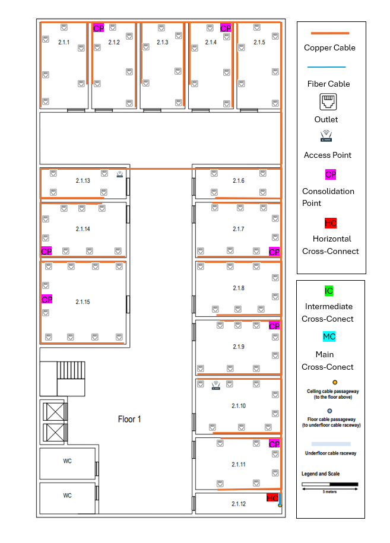

## Building 2 ##

### Floor 0 (Ground Floor) ###

### 1.Information ###
- The ceiling height on this floor is 4 meters.
- Common areas, like the entrance hall, restrooms, and stairs, require no network outlets.
- Rooms 2.0.6 and 2.0.7 have specific
  purposes and the only network outlets required there are 5 near each floor cable passageway.
- Room 2.0.11 is a storage area, no network outlets are
  required there as well, and it may be used to house a cross-connect and other network infrastructure
  hardware.
- In every identified room, the standard number of network outlets per area rate should be honoured.

## 2.Measurements ###

| Rooms  | Area in m2 | Nº outlets |
|--------|------------|------------|
| 2.0.1  | 29,70      | 6          |
| 2.0.2  | 29,70      | 6          |
| 2.0.3  | 19,14      | 4          |
| 2.0.4  | 19,14      | 4          |
| 2.0.5  | 53,00      | 12         |
| 2.0.6  | 93,50      | 5          |
| 2.0.7  | 93,50      | 5          |
| 2.0.8  | 28,05      | 6          |
| 2.0.9  | 28,05      | 6          |
| 2.0.10 | 15,52      | 4          |

### 3.Floor 0 Inventory ###

- 58 outlets.
-  Consolidation Points.
-  Switches.
- 1 Horizontal Cross-connects.
- 1 Intermediate Cross-connect.
- 2 Access Points with a radium of 25m.
- CAT7 copper cable  meters.

### Floor 1 ###

### 1.Information ###
- The ceiling height on this floor is 3 meters, however there’s a removable dropped ceiling, placed 2.5 meters from the ground, covering the entire floor.
- The space over the dropped ceiling is perfect to install cable raceways and wireless access-points.
- No network outlets are required at restrooms and common areas like corridors and halls.
- Room 2.1.12 is a storage area, no network outlets are
  required there as well, and it may be used to house a cross-connect and other network infrastructure
  hardware.
- In every identified room, the standard number of network outlets per area rate should be honoured.

## 2.Measurements ###

| Room   | Area in m2 | Nº outlets |
|--------|-----------|------------|
| 2.1.1  | 26,91     | 6          |
| 2.1.2  | 25,53     | 6          |
| 2.1.3  | 25,53     | 6          |
| 2.1.4  | 25,53     | 6          |
| 2.1.5  | 25,53     | 6          |
| 2.1.6  | 17,25     | 4          |
| 2.1.7  | 30,36     | 8          |
| 2.1.8  | 30,36     | 8          |
| 2.1.9  | 30,36     | 8          |
| 2.1.10 | 30,36     | 8          |
| 2.1.11 | 28,98     | 6          |
| 2.1.13 | 17,25     | 4          |
| 2.1.14 | 30,36     | 8          |
| 2.1.15 | 46,23     | 10         |

### 3.Floor 1 Inventory ###

- 60 outlets.
-  Consolidation Points.
-  Switches.
- 1 Horizontal Cross-connects.
- 2 Access Point with a radium of 25m.
- CAT7 copper cable  meters.

### Full Inventory ###

- 152 outlets.
-  Consolidation Points.
-  Switches.
- 2 Horizontal Cross-connects.
- 1 Intermediate Cross-connect.
- 4 Access Point with a radium of 25m.
- CAT7 copper cable  meters.
