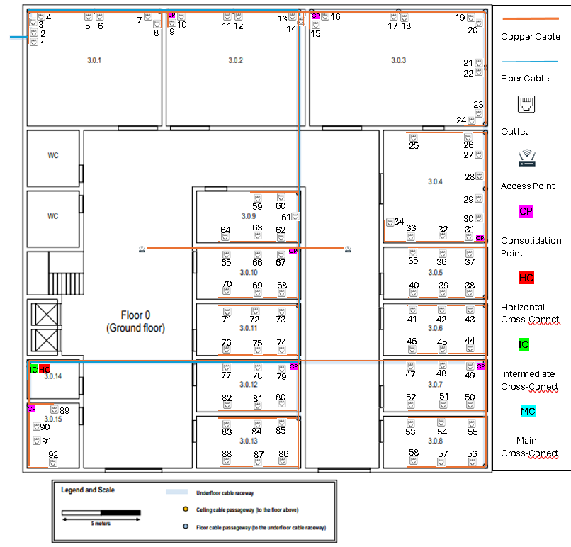
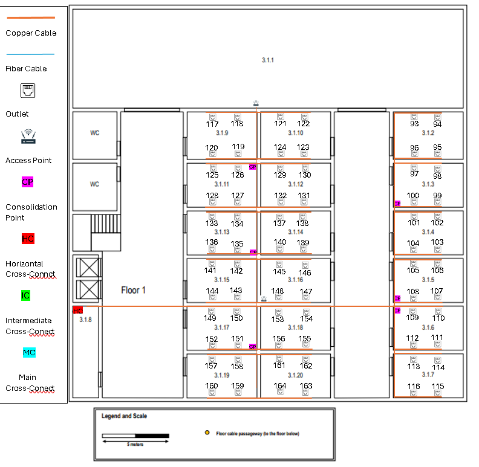

## Building 3 ##

### General Information ###

- The buildings 3, have the same horizontal dimensions, approximately, 30 x 30 meters.
- A full wireless LAN (Wi-Fi) coverage is required for this building on both floors.

## 1. Information ##

### Floor 0 ###

- The ground floor has an underfloor cable raceway connected to the external technical ditch.
- Access to the underfloor cable raceway is available at points marked over the plan.
- The ceiling height on this floor is four meters.
- Room 3.0.14 is a storage area that may be used to house a cross-connect, no network outlets are required there, and the same applies to restrooms, halls, and corridors.
- Rooms 3.0.1, 3.0.2, and 3.0.3 have specific purposes and the only network outlets required there are two near each floor cable passageway.
- Elsewhere, the standard number of network outlets per area ratio is to be enforced.

### Floor 1  ###

- The ceiling height on this floor is three meters, but there is a removable dropped ceiling, placed 2.5 meters from the ground, covering this entire floor.
- The empty space over the dropped ceiling is perfect to install cable raceways and wireless access-points.
- Room 3.1.1 is a wireless only area, no network outlets are required, but on the other hand the wireless LAN coverage (Wi-Fi) should be highly effective here.
- Shared areas and restrooms are not required to have network outlets, other rooms should be provided with the standard number of network outlets.
- Room 3.1.8 is a storage area, no network outlets are required there as well, and it may be used to house a cross-connect and other network infrastructure hardware.

## 2. Measurements ##

**Excel with all the details about measurements**
- [Download Measurements_Building3.xlsx](Measurements_Building3.xlsx)

### Floor 0 ###

| Rooms  | Area in m2 | Nº outlets |
|--------|------------|------------|
| 3.0.1  | 65.3       | 8          |
| 3.0.2  | 66         | 6          |
| 3.0.3  | 86.3       | 10         |
| 3.0.4  | 47.6       | 10         |
| 3.0.5  | 22.1       | 6          |
| 3.0.6  | 22.1       | 6          |
| 3.0.7  | 22.1       | 6          |
| 3.0.8  | 22.1       | 6          |
| 3.0.9  | 22.1       | 6          |
| 3.0.10 | 22.1       | 6          |
| 3.0.11 | 22.1       | 6          |
| 3.0.12 | 22.1       | 6          |
| 3.0.13 | 22.1       | 6          |
| 3.0.14 | 8.3        | 0          |
| 3.0.15 | 13.9       | 4          |

***Total Outlets:*** 92

### Floor 1 ###

| Rooms  | Area in m2 | Nº outlets |
|--------|------------|------------|
| 3.1.1  | 25.49      | 0          |
| 3.1.2  | 25.49      | 4          |
| 3.1.3  | 84.11      | 4          |
| 3.1.4  | 26.27      | 4          |
| 3.1.5  | 42.05      | 4          |
| 3.1.6  | 42.05      | 4          |
| 3.1.7  | 42.05      | 4          |
| 3.1.8  | 42.05      | 0          |
| 3.1.9  | 42.05      | 4          |
| 3.1.10 | 42.05      | 4          |
| 3.1.11 | 42.05      | 4          |
| 3.1.12 | 42.05      | 4          |
| 3.1.13 | 42.05      | 4          |
| 3.1.14 | 42.05      | 4          |
| 3.1.15 | 42.05      | 4          |
| 3.1.16 | 42.05      | 4          |
| 3.1.17 | 42.05      | 4          |
| 3.1.18 | 42.05      | 4          |
| 3.1.19 | 42.05      | 4          |
| 3.1.20 | 42.05      | 4          |

***Total Outlets:*** 72

## 3. Structured Cabling Schematic Plan ##

### Floor 0 ###

### Floor 1 ###

## 4. Inventory ##

## ***Cables*** ##

As defined by the team in the Planning section:
- copper cables will be **Category 7 (CAT7) Copper Cables**.
- fiber cables will be **Monomode Fiber Cables**.

The maximum distance of the cables is **90 meters**.

**The Horizontal Cross-Connect (HCC) and the Consolidation Point (CP) must be placed 1.7m from the floor.** 

**The outlets must be placed 0.7m from the floor.**

These details are already included in the cable measurements.

### Floor 0 ###

***CAT7 Copper Cables:***

- From HC to CP's: 211.5m
- From CP's to Outlets: 615.7m
- From HC to Acess Point: 74.3m

Total Copper Cable Length: 901.5m

***Monomode Fiber Cable:***

**From Outside to ICC:** 62.7m
- **From ICC to HCC (Room 3.0.14):** 1m

Total Fiber Cable: 63.7m

### Floor 1 ###

***CAT7 Copper Cables:***

- From HC to CP's: 147.1m
- From CP's to Outlets: 343.7m
- From HC to Acess Point: 46.2m

Total Copper Cable Length: 537m

***Monomode Fiber Cable:***

**From ICC to HCC (Room 3.1.8):** 6.2m

Total Fiber Cable: 6.2m

## ***Patch Panels*** ##

The patch panels must comply with the cable specifications. 
Since we chose CAT7 cables, all patch panels will also be CAT7.
Similarly, as we selected Monomode Fiber Cable, the Fiber Patch Panels must be compatible with Monomode as well.

### Floor 0 ###

- 1 patch panel of 12 ports (ICC)(Room 3.0.14);
- 2 patch panels of 12 ports (HCC)(Room 3.0.14) (Copper patch panel and Fiber patch panel);
- 2 patch panels of 12 ports (CP's)(Rooms 3.0.3, 3.0.15);
- 5 patch panel of 24 ports (CP's)(Rooms 3.0.2, 3.0.4, 3.0.7, 3.0.10, 3.0.12);

#### Total: **4 patch panels of 12 ports** and **5 patch panels of 24 ports**

### Floor 1 ###

- 2 patch panels of 12 ports (HCC)(Room 3.0.14) (Copper patch panel and Fiber patch panel);
- 3 patch panels of 12 ports (CP's)(Rooms 3.1.3, 3.1.5, 3.1.6);
- 3 patch panel of 24 ports (CP's)(Rooms 3.1.11, 3.1.13, 3.1.17);

#### Total: **4 patch panels of 12 ports** and **3 patch panels of 24 ports**

## ***Racks*** ##

### Floor 0 ###

For the **Intermediate Cross-Connect:**

- **1U** for 1 fiber patch panel of 12 ports;
- **1U** switch;
- **2U** an additional 100% over dimensioning.

#### **Total**: 4U

For the **Horizontal Cross-Connect:**

- **1U** for 1 copper patch panel of 12 ports;
- **1U** for 1 fiber patch panel of 12 ports;
- **1U** switch;
- **3U** an additional 100% over dimensioning.

#### **Total**: 6U

For each of the 2 **Consolidation Point (12 ports)**

- **1U** for 1 copper patch panel of 12 ports;
- **1U** switch;
- **2U** an additional 100% over dimensioning.

#### **Total**: 4U

For each of the 5 **Consolidation Point (24 ports)**

- **1U** for 1 copper patch panel of 24 ports;
- **1U** switch;
- **2U** an additional 100% over dimensioning.

#### **Total**: 4U

### Floor 1 ###

For the **Horizontal Cross-Connect:**

- **1U** for 1 copper patch panel of 12 ports;
- **1U** for 1 fiber patch panel of 12 ports;
- **1U** switch;
- **3U** an additional 100% over dimensioning.

#### **Total**: 6U

For each of the 3 **Consolidation Point (12 ports)**

- **1U** for 1 copper patch panel of 12 ports;
- **1U** switch;
- **2U** an additional 100% over dimensioning.

#### **Total**: 4U

For the 3 **Consolidation Point (24 ports)**

- **1U** for 1 copper patch panel of 24 ports;
- **1U** switch;
- **2U** an additional 100% over dimensioning.

#### **Total**: 4U

## **TOTAL INVENTORY** ##

- Outlets: 164
- CAT7 Copper Cable (m): 1438.5
- Monomode Fiber Cable (m): 69.9
- Intermediate Cross-Connect (ICC): 1
- Horizontal Cross-Connect (HCC): 2
- Consolidation Points (CP with 12 ports) : 5
- Consolidation Points (CP with 24 ports): 8
- Access Point (AP): 4
- Copper Patch Panels (12 ports): 7
- Fiber Patch Panels (12 ports): 3
- Copper Patch Panels (24 ports): 8
- Telecommunications Enclosures: 16

