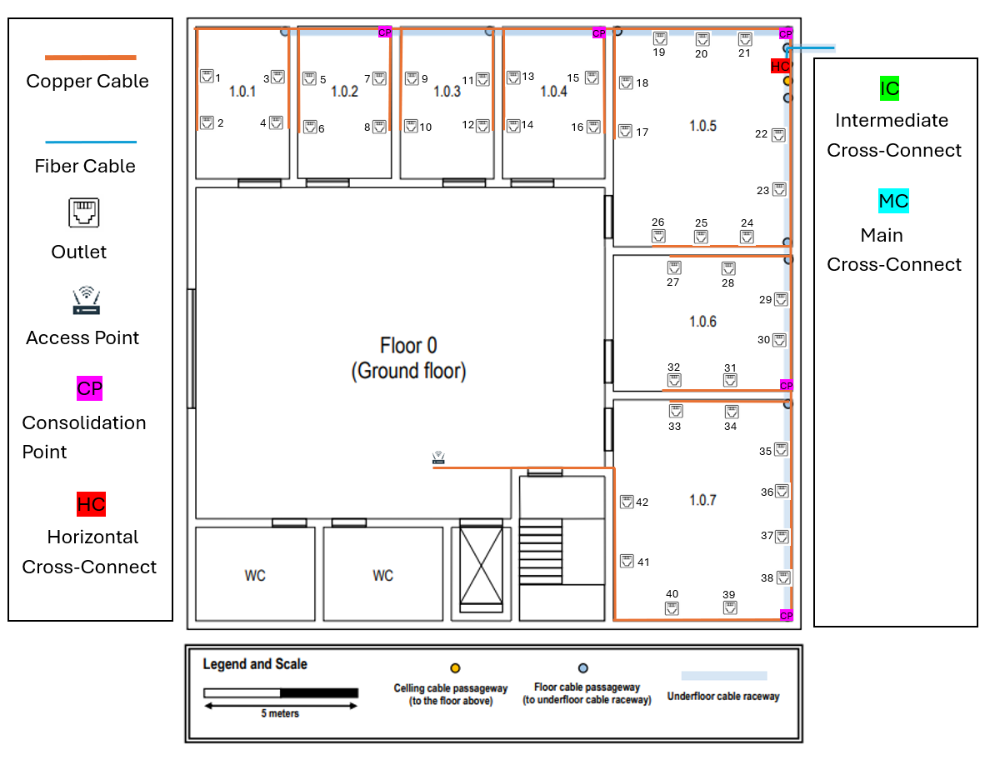

## Building 1 ##

### General Information ###

- This building horizontal dimensions are, approximately, 20x20 meters.
- It holds the datacenter (room 1.1.3), it will also house the main cross-connect for the structured cabling system.
- Both floors must have wireless LAN coverage (Wi-Fi).

## 1. Information ##

### Floor 0 ###

- The ground floor has an underfloor cable raceway connected to the external technical ditch.
- The ceiling height on this floor is 4 meters.
- Shared areas, like the entrance hall, restrooms, and stairs, require no network outlets.

### Floor 1  ###

- The ceiling height on this floor is 3 meters, however there’s a removable dropped ceiling, placed 2.5 meters from the ground, covering the entire floor.
- The space over the dropped ceiling is perfect to install cable raceways and wireless access-points.
- This floor has no underfloor cable raceways.
- No network outlets are required at restrooms and common areas like corridors and halls.
- The datacenter (room 1.1.3) has a specialized cabling system that is out of the scope of this project, therefore,
no network outlets are to be included there.
- In every identified room, the standard number of network outlets per area rate should be honoured.

## 2. Measurements ##

**Excel with all the details about measurements**
- [Download Measurements_Building1.xlsx](Measurements_Building1.xlsx)

### Floor 0 ###

| Rooms  | Area in m2 | Nº outlets |
|--------|------------|------------|
| 1.0.1  | 15.15      | 4          |
| 1.0.2  | 15.15      | 4          |
| 1.0.3  | 15.15      | 4          |
| 1.0.4  | 16.95      | 4          |
| 1.0.5  | 42.05      | 10         |
| 1.0.6  | 26.27      | 6          |
| 1.0.7  | 42.05      | 10         |

***Total Outlets:*** 42 + 1 (Access Point)

### Floor 1 ###

| Rooms | Area in m2 | Nº outlets |
|-------|------------|------------|
| 1.1.1 | 25.49      | 6          |
| 1.1.2 | 25.49      | 6          |
| 1.1.3 | 84.11      | 0          |
| 1.1.4 | 26.27      | 6          |
| 1.1.5 | 42.05      | 10         |

***Total Outlets:*** 28 + 1 (Access Point)

## 3. Structured Cabling Schematic Plan ##

### Floor 0 ###

### Floor 1 ###

## 4. Inventory ##

## ***Cables*** ##

As defined by the team in the Planning section:
- copper cables will be **Category 7 (CAT7) Copper Cables**.
- fiber cables will be **Monomode Fiber Cables**.

The maximum distance of the cables is **90 meters**.

**The Horizontal Cross-Connect (HCC) and the Consolidation Point (CP) must be placed 1.7m from the floor.** 

**The outlets must be placed 0.7m from the floor.**

These details are already included in the cable measurements.

### Floor 0 ###

***CAT7 Copper Cables:***

- From HC to CP's: 52.75m
- From CP's to Outlets: 341.06m
- From HC to Acess Point: 35.5m

Total Copper Cable Length: 429.31m

***Monomode Fiber Cable:***

**From MCC to Outside:** 8.5m
- **From ICC to HCC (Room 1.0.5):** 6m

Total Fiber Cable: 14.5m

### Floor 1 ###

***CAT7 Copper Cables:***

- From HC to CP's: 64m
- From CP's to Outlets: 225.12m
- From HC to Acess Point: 26m

Total Copper Cable Length: 315.12m

***Monomode Fiber Cable:***

- **From MC to ICC (Room 1.1.3):** 0.5m
- **From ICC to HCC (Room 1.1.3):** 0.5m

Total Fiber Cable: 1m

## ***Patch Panels*** ##

The patch panels must comply with the cable specifications. 
Since we chose CAT7 cables, all patch panels will also be CAT7.
Similarly, as we selected Monomode Fiber Cable, the Fiber Patch Panels must be compatible with Monomode as well.

### Floor 0 ###

- 2 patch panels of 12 ports (HCC)(Room 1.0.5)   (Copper patch panel and Fiber patch panel);
- 3 copper patch panels of 12 ports (CP's)(Rooms 1.0.2, 1.0.4, 1.0.6);
- 2 copper patch panel of 24 ports (CP)(Rooms 1.0.7, 1.0.5);

#### Total: **4 copper patch panels of 12 ports**,**1 fiber patch panel of 12 ports**  and **2 copper patch panels of 24 ports**

### Floor 1 ###

- 1 fiber patch panel of 12 ports (MCC)(Room 1.1.3);
- 1 fiber patch panel of 12 ports (ICC)(Room 1.1.3);
- 2 patch panels of 12 ports (HCC)(Room 1.1.3) (Copper patch panel and Fiber patch panel);
- 3 copper patch panels of 12 ports (CP's)(Rooms 1.1.1, 1.1.2, 1.1.4);
- 1 copper patch panel of 24 ports (CP)(Room 1.1.5);

#### Total: **4 copper patch panels of 12 ports**,**3 fiber patch panel of 12 ports**  and **1 copper patch panel of 24 ports**

## ***Racks*** ##

### Floor 0 ###

For the **Horizontal Cross-Connect:** 

- **1U** for 1 copper patch panel of 12 ports;
- **1U** for 1 fiber patch panel of 12 ports;
- **1U** switch;
- **3U** an additional 100% over dimensioning.

#### **Total**: 6U

For each of the 3 **Consolidation Point (12 ports)**

- **1U** for 1 copper patch panel of 12 ports;
- **1U** switch;
- **2U** an additional 100% over dimensioning.

#### **Total**: 4U

For each of the 2 **Consolidation Point (24 ports)**

- **1U** for 1 copper patch panel of 24 ports;
- **1U** switch;
- **2U** an additional 100% over dimensioning.

#### **Total**: 4U

### Floor 1 ###

For the **Main Cross-Connect:**

- **1U** for 1 fiber patch panel of 12 ports;
- **1U** switch;
- **2U** an additional 100% over dimensioning.

#### **Total**: 4U

For the **Intermediate Cross-Connect:**

- **1U** for 1 fiber patch panel of 12 ports;
- **1U** switch;
- **2U** an additional 100% over dimensioning.

#### **Total**: 4U

For the **Horizontal Cross-Connect:**

- **1U** for 1 copper patch panel of 12 ports;
- **1U** for 1 fiber patch panel of 12 ports;
- **1U** switch;
- **3U** an additional 100% over dimensioning.

#### **Total**: 6U

For each of the 3 **Consolidation Point (12 ports)**

- **1U** for 1 copper patch panel of 12 ports;
- **1U** switch;
- **2U** an additional 100% over dimensioning.

#### **Total**: 4U

For the 1 **Consolidation Point (24 ports)**

- **1U** for 1 copper patch panel of 24 ports;
- **1U** switch;
- **2U** an additional 100% over dimensioning.

#### **Total**: 4U

## **TOTAL INVENTORY** ##

- Outlets: 72
- CAT7 Copper Cable (m): 744.43
- Monomode Fiber Cable (m): 15.5
- Main Cross-Connect (MCC): 1
- Intermediate Cross-Connect (ICC): 1
- Horizontal Cross-Connect (HCC): 2
- Consolidation Points (CP with 12 ports) : 6
- Consolidation Points (CP with 24 ports): 3
- Access Point (AP): 2
- Copper Patch Panels (12 ports): 8
- Fiber Patch Panels (12 ports): 4
- Copper Patch Panels (24 ports): 3
- Telecommunications Enclosures: 13

