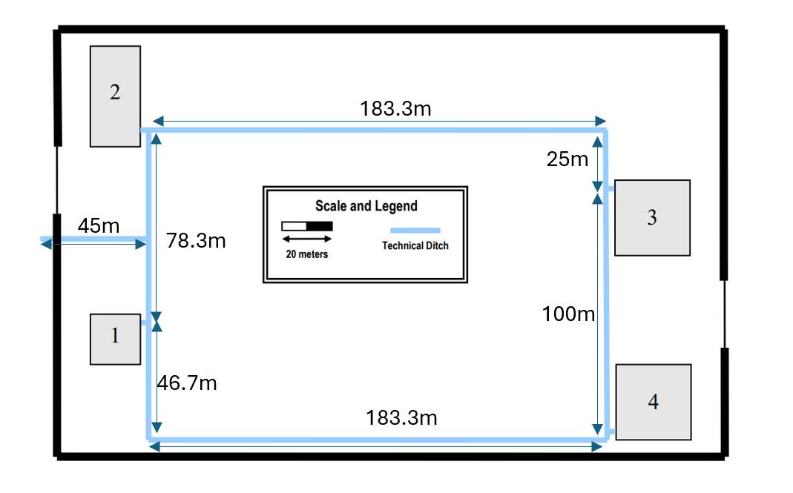

## Building Backbone ##

### Outside ###

***Monomode Fiber Cable:***

From B1 to:

- B2: 81.5m
- B3: 290m
- B4: 234m

Total Fiber Cable Used Outside: 605.5m

## **Global INVENTORY** ##

### **Outlets** ###
- Total: 560

### **Cables** ###
- **Monomode Fiber Cable:**
  - Total: 715.27m

- **CAT7 Copper Cables:**
  - Total: 7165.86m

### **Cross-Connects** ###
- **Main Cross-Connects:**
    - Total: 1
- **Intermediate Cross-Connects:**
    - Total: 4
- **Horizontal Cross-Connects:**
  - Total: 8

### **Consolidation Points** ###

- **Consolidation Points (12 ports):**
  - Total: 22

- **Consolidation Points (24 ports):**
  - Total: 19

### **Access Points** ###
  - Total: 18

### **Patch Panels** ###
- **Copper Patch Panels:**
  - Total: 22 patch panels of 12 ports
  - Total: 28 patch panels of 24 ports

- **Fiber Patch Panels:**
  - Total: 13 patch panels of 12 ports

### **Racks** ###
- **Total: 54 telecommunications enclosures**

